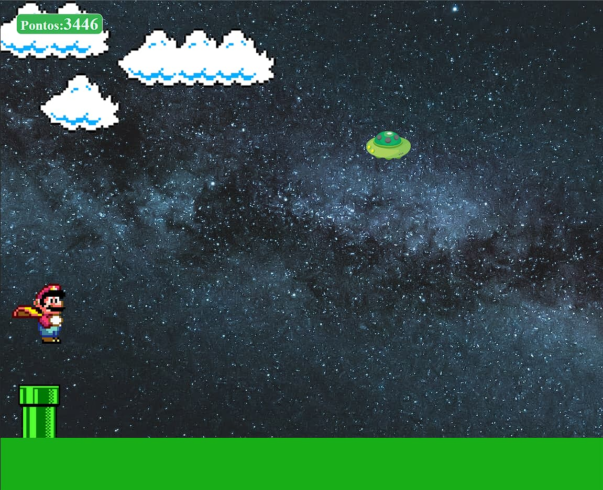

<h1 align="center"> Mario_Game_StartSe </h1>

Mario game é um projeto desenvolvido durante o Tech Academy, promovido pela StartSe.  

  <a href="#-tecnologias">Tecnologias</a>&nbsp;&nbsp;&nbsp;|&nbsp;&nbsp;&nbsp;
  <a href="#-projeto">Projeto</a>&nbsp;&nbsp;&nbsp;|&nbsp;&nbsp;&nbsp;
  <a href="#memo-licença">Licença</a>

  

 

  

## 🚀 Tecnologias

Esse projeto foi desenvolvido com as seguintes tecnologias:

- HTML e CSS
- JavaScript
- Git e Github

## 💻 Projeto

Mario game.

- [Jogue agora o projeto finalizado, online](https://gabtech1.github.io/Mario_Game_StartSe/)

## :memo: Licença

Esse projeto está sob a licença MIT.

---

Obrigado por visitar e divirta-se 😉